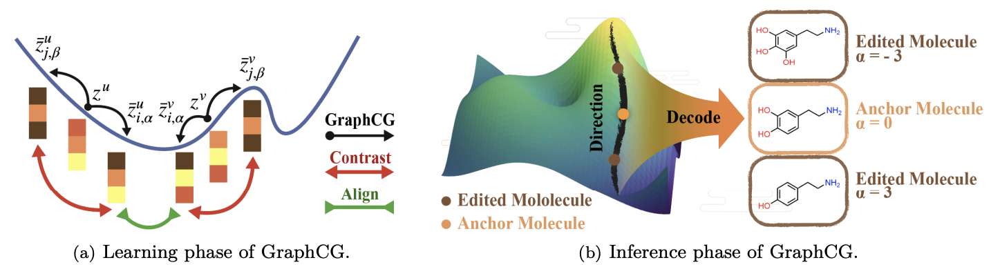
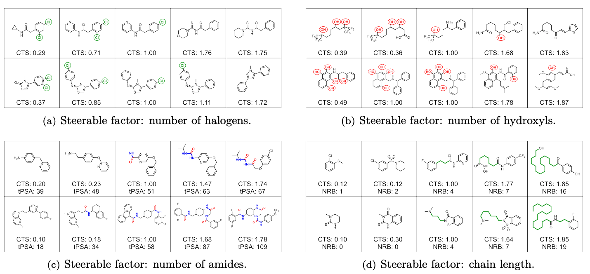
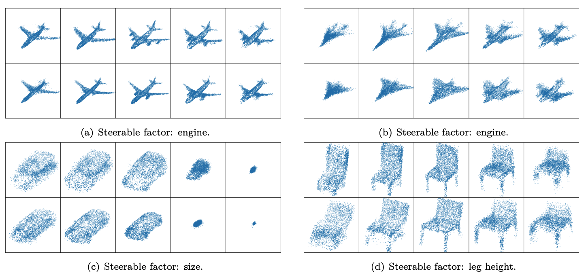

# Unsupervised Discovery of Steerable Factors When Graph Deep Generative Models Are Entangled

**TMLR 2024**

Authors: Shengchao Liu, Chengpeng Wang, Jiarui Lu, Weili Nie, Hanchen Wang, Zuoxinran Li, Bolei Zhou, Jian Tang

<p align="center">
   
</p>

This repository provides the source code for the paper **GraphCG: Unsupervised Discovery of Steerable Factors When Graph Deep Generative Models Are Entangled**, which aims at:
- exploring the steerable factors in graphs
- implementing the graph controllable generation in an unsupervised manner

[[Project Page](https://chao1224.github.io/GraphCG)]
[[Paper](https://openreview.net/forum?id=wyU3Q4gahM)]
[[ArXiv](https://arxiv.org/abs/2401.17123)]
<br>
[[NeurIPS Graph Learning Frontiers Workshop 2022](https://glfrontiers.github.io/)]

# 1.1 Molecular Graph

<p align="center">
   
</p>

### 1.1 Environment

```
conda create --name GraphCG python=3.7 pandas matplotlib
conda activate GraphCG

conda install -y -c pytorch pytorch=1.7.0 torchvision cudatoolkit=10.2
conda install -y -c rdkit rdkit=2019.03.4
conda install -y tabulate
conda install -y networkx
conda install -y scipy
conda install -y seaborn
conda install -y -c conda-forge opencv
pip install cairosvg
pip install orderedset
pip install pickle5
pip install git+https://github.com/bp-kelley/descriptastorus
pip install PyTDC
pip install scikit-learn==0.23
pip install gdown

pip install .
```

### 1.2 MoFlow

1. Go to directory, `cd MoFlow`.
2. Download datasets and pretrained models,
```
python step_01_download.py
unzip MoFlow.zip
```
3. Set up model weight path,
```
qm9_folder=./results_reported/qm9_64gnn_128-64lin_1-1mask_0d6noise_convlu1
zinc250k_folder=./results_reported/zinc250k_512t2cnn_256gnn_512-64lin_10flow_19fold_convlu2_38af-1-1mask
chembl_folder=./results_reported/chembl
```
4. Run testing scripts using `bash test_GraphCG.sh`.
5. Submit SLURM jobs using `bash submit_*.sh`.

## 1.3 HierVAE

1. Go to directory, `cd HierVAE`.
2. Download datasets and pretrained models,
```
python step_01_download.py
unzip HierVAE.zip
```
3. Set up model weight path,
```
data_name=qm9
model=results_reported/qm9/model.ckpt
```
4. Run testing scripts using `bash test_GraphCG.sh`. Notice that please make sure the GPU is enabled.
5. Submit SLURM jobs using `bash submit_*.sh`.


## 2 Point Clouds

<p align="center">
   
</p>

## 2.1 Environment
```
conda create -n GraphCG python=3.6
conda activate GraphCG

conda install pytorch=1.9.1 torchvision -c pytorch -y
conda install numpy matplotlib pillow scipy tqdm scikit-learn -y
conda install tensorflow-gpu==1.13.1 -y
pip install tensorboardX==1.7
pip install pandas
pip install torchdiffeq==0.0.1
pip install cython
conda install -c sirokujira python-pcl --channel conda-forge
pip install gdown

pip install -e .
```

## 2.2 PointFlow

1. Go to directory, `cd PointFlow`.
2. Download datasets,
```
python step_01_download.py
unzip ShapeNetCore.v2.PC15k.zip
unzip pretrained_models.zip
```
3. Set up data path,
```
data_dir=ShapeNetCore.v2.PC15k
```
4. Run testing scripts using `bash test_GraphCG.sh`. Notice that please make sure the GPU is enabled.
5. Submit SLURM jobs using `bash submit_*.sh`.


## Cite Us

Feel free to cite this work if you find it useful to you!

```
@article{liu2024unsupervised,
    title={Unsupervised Discovery of Steerable Factors When Graph Deep Generative Models Are Entangled},
    author={Shengchao Liu and Chengpeng Wang and Jiarui Lu and Weili Nie and Hanchen Wang and Zhuoxinran Li and Bolei Zhou and Jian Tang},
    journal={Transactions on Machine Learning Research},
    issn={2835-8856},
    year={2024},
    url={https://openreview.net/forum?id=wyU3Q4gahM},
    note={}
}
```